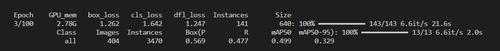
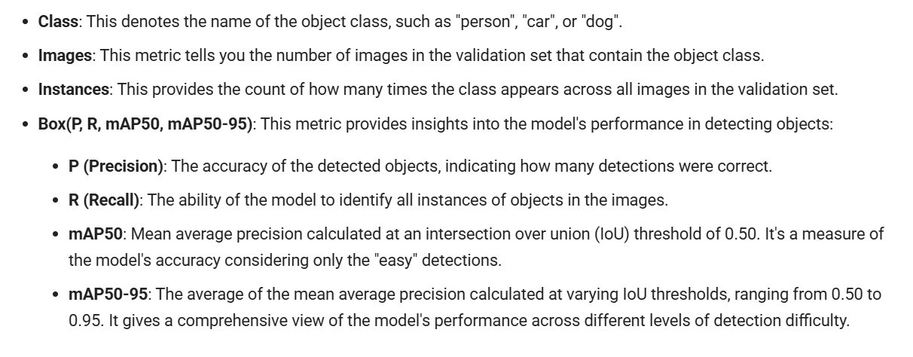
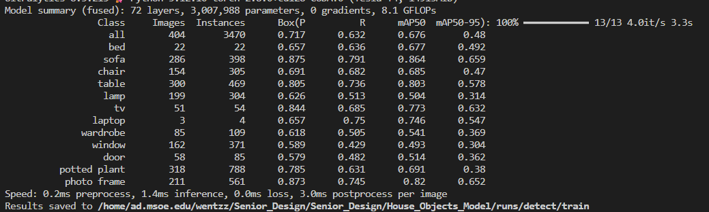
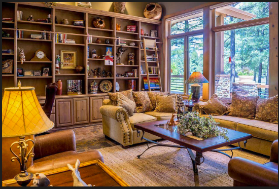
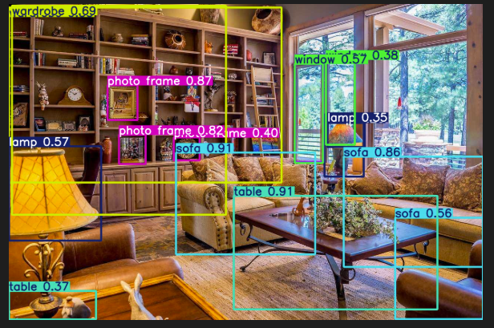
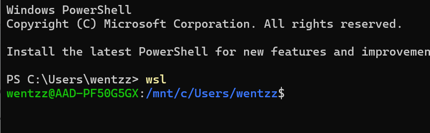
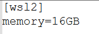
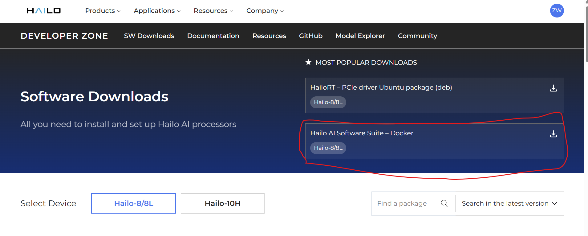
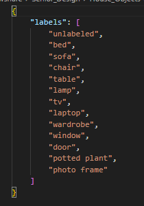
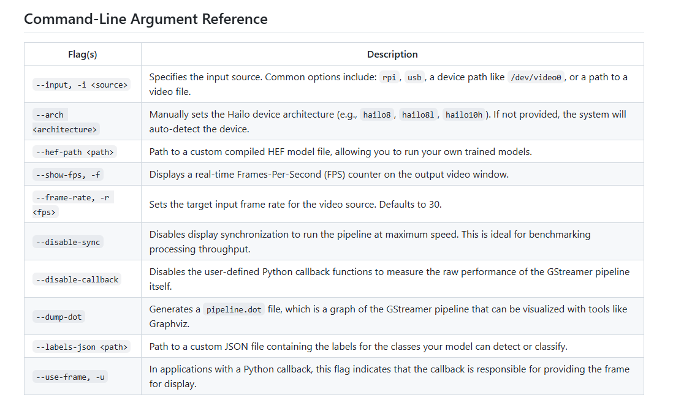

# Creating a Custom HEF Model
Below is a series of steps to take to develop a custom HEF model (rather than only being able to use the default models provided by Hailo). 
1. First, you need to train a YOLO model: https://docs.ultralytics.com/modes/train/#python
    - You will need a dataset to train on. This is a good place to find some datasets: https://universe.roboflow.com/
    - I chose the dataset described in this site: https://docs.ultralytics.com/datasets/detect/homeobjects-3k/
        - Home objects
            - Training set is 2,285 annotated images
            - Validation set is 404 annotated images
            - Object categories: Bed, sofa, chair, table, lamp, tv, laptop, wardrobe, window, door, potted plant, photo frame
            - Here is the URL to get the zip that contains the train and validation images: 
            https://github.com/ultralytics/assets/releases/download/v0.0.0/homeobjects-3K.zip
            - Comment out the 'path' in the HomeObjects-3K.yaml file
    - Either create a Python file or use the CLI command
        - There are directions for either in this site in the "Usage" section: https://docs.ultralytics.com/datasets/detect/homeobjects-3k/
        - CLI command: <br>
            ```yolo detect train data=HomeObjects-3K.yaml model=yolov8n.pt epochs=100 imgsz=640```
                
            - You can use yolov8n.pt, not yolov11n.pt, because yolov11n.pt is not compatible with Hailo HEF models
        - Here is what you will see in the output after each epoch (an epoch is the model seeing the entire training dataset once)
            

            - Below is an explanation of some of the fields
            

            - IoU measures how much the predicted bounding box matches the ground truth box
                - IoU threshold of 0.5 means a predicted box is considered a true positive if it overlaps with a ground-truth box by at least 50%
                    - mAP50 is saying "on average, how accurate is my model at detecting objects with IoU >= 50%"
                - mAP50 only cares if boxes overlap by 50%. To calculate mAP50:
                    - Predicted boxes are compared to ground-truth boxes
                    - True positives = predictions with IoU >= threshold
                    - Compute precision-recall curve, then average precision
                - mAP50-95  checks multiple IoU thresholds. 
                    - For each threshold, do the same steps as mAP50
                        - Predicted boxes are compared to ground-truth boxes
                        - True positives = predictions with IoU >= threshold
                        - Compute precision-recall curve, then average precision
                    - Compute average precision at each IoU threshold, then take average across all thresholds for each class. Then take mean across all classes to get mAP50-95
                    - mAP50-95 is stricter than mAP50 as mAP50 checks multiple thresholds (it rewards precise localization)
            - As the model trains, it is good to see precision, recall, mAP50, and mAP50-95 increase
    - At the end of training, you will see this summary
        


        - This gives us an idea of how the model performs. In this case, it should do well on sofas, but it may struggle on wardrobes
    - The best model will be in runs/detect/train/weights/ as best.pt
2. Convert the trained YOLO model to an ONNX model: https://docs.ultralytics.com/integrations/onnx/#cli_1
    - You can create a Python script or use the CLI to export the YOLO model to ONNX
    - I used CLI
        - It will be something like this: yolo export model=yolo11n.pt format=onnx
            - Adjust your path to your best.pt model based on your project
    - You can test the onnx model with a command similar to this: yolo predict model=yolo11n.onnx source='https://ultralytics.com/images/bus.jpg'
        - Source can be a local jpg image
        - Adjust your model and source paths based on the images you want to use
        - This will generate an image with predictions from the onnx model. For example, I had my model predict labels for the first image below (this image wasn't used for training the original yolo model), and it gave me the image below that with predictions
            
            

3. Converting the ONNX model to an HEF model
    - Install Ubuntu via Windows Subsystem for Linux 2 on your computer
        - Open a Terminal as an administrator
        - Enter the command "wsl --install"
            - Allow process to make changes
        - Changes will not be effective until you reboot your computer, so use the "restart-computer" command in the Terminal to do this
        - Once your computer reboots, you will be prompted to enter username/password
        - Issue "sudo apt update && sudo apt upgrade -y" command
        - You can issue the command "wsl" in a Terminal to launch the default Linux distribution
            

    - Make a .wslconfig file in C:\Users\<username here>
        - Put these two lines in it <br>
            

    - Install Docker desktop (AMD64): https://www.docker.com/products/docker-desktop/
        - Once download is complete, open the Docker Desktop app and make an account
    - Download "Hailo AI Software Suite - Docker" from here https://hailo.ai/developer-zone/software-downloads/ (need to make an account)
            
        
    - Follow the instructions here to start a Docker container (summary is below): https://hailo.ai/developer-zone/documentation/hailo-sw-suite-2025-10-for-hailo-8-8l/?sp_referrer=suite/suite_install.html
        - In a WSL terminal, issue the command "sudo usermod -aG docker ${USER}"
        - Make a C:\hailo_models directory on your computer, move the downloaded 'Hailo AI Software Suite - Docker" zip file there, and then unzip the zip file
        - Then in that directory run the command "sudo ./hailo_ai_sq_suite_docker_run.sh"
            - This should start your Docker container up
            - In the future, you can use "sudo ./hailo_ai_sq_suite_docker_run.sh --resume" to go back to the existing container
    - Compile the model using Hailo Model Zoo
        - In your C:\hailo_models directory, you should see a shared_with_docker folder in this path: C:\hailo_models\hailo8_ai_sw_suite_2025-10_docker\shared_with_docker
            - You can put files in here and then access them from within your Docker container
                - Otherwise, you can't access files outside of your Docker container
            - Put your best.onnx model file, your original yaml for YOLO training, and the raw images used for training your initial YOLO model in the shared_with_docker folder
                
        - Issue a command like this in the Docker container (SEE FURTHER BELOW FOR MY COMMAND I USED): <br>
            ```hailomz compile --ckpt best.onnx --calib-path /path/to/calibration/imgs/dir/ --yaml path/to/yolov8n.yaml --classes 12  --hw-arch hailo8l```
            - ckpt is the onnx model you made earlier
            - calib-path is the path for calibration images. You can use the images from training your original YOLO model for this
                - If you put the images in the shared_with_docker folder, the images shold be in /local/shared_with_docker/<folder with images>
            - yaml tells what YOLO model was used for training
            - hw-arch is hardware architecture (hailo8 for 26 TOPS AI HAT, hailo8l for 13 TOPS AI HAT)
            - classes is the number of objects/classes your model detects (in our case, it is 12 household objects)
                
        - Here is the command I used: <br>
    ```hailomz compile --ckpt ./../shared_with_docker/House_Objects_Model/best.onnx --calib-path ./../shared_with_docker/House_Objects_Model/train_images --yaml hailo_model_zoo/hailo_model_zoo/cfg/networks/yolov8n.yaml --classes 12 --hw-arch hailo8l```

        - This will create a yolov8n.hef file. You can move this file to your shared_with_docker folder, then transfer it to your Raspberry Pi and use it
            - To have the labels be correct, you need to create a custom json file and write labels. It should look something like below, and the labels should be in the order they were in the yaml file you used for training. The first label will need to be "unlabeled".
            
            

            - Video: Raspberry Pi AI Kit - Custom YOLOV8 Object Detection (https://www.youtube.com/watch?v=7pgSFgqo8gY)
                - According to the video above, we can also specify things other than labels in the custom json file
                    - We can set a detection threshold (like 0.7) so that the model only shows it "detecting" an object if it has 70% confidence or greater for that object.
    
    - Here is some official documentation on the whole process: https://github.com/hailo-ai/hailo_model_zoo/tree/833ae6175c06dbd6c3fc8faeb23659c9efaa2dbe/training/yolov8
    - Here is an example: https://github.com/hailo-ai/hailo-apps-infra/blob/main/doc/developer_guide/retraining_example.md
    - Here is a YouTube video on this process: https://www.youtube.com/watch?v=Dm37x7sObIc
    - Here is a YouTube video on this process: https://www.youtube.com/watch?v=7pgSFgqo8gY
    
    
    
    - When we run a model, we can use these command line arguments. We will need to use the --input flag to specify our Raspberry Pi as the input source (--input rpi). We will need to use the --hef-path to have our custom .hef model be used (--hef-path custom_model.hef, for example). We will need to use the --labels-json to specify the custom JSON file with labels for classes our model can detect (--labels-json house_objects.json, for example).
            
